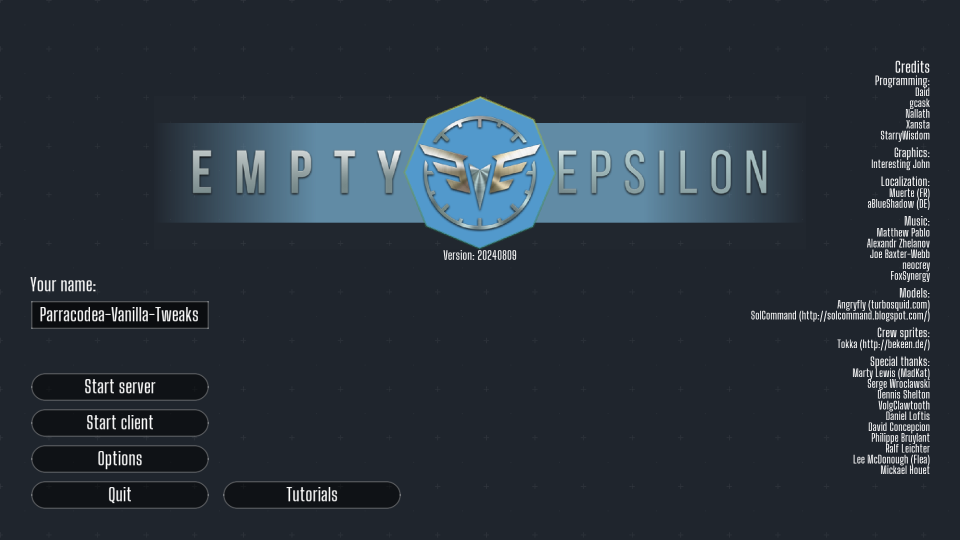

# EmptyEpsilon: Parracodea Vanilla Tweaks

_A mod for [EmptyEpsilon](https://daid.github.io/EmptyEpsilon/)_

Mod created by Parracodea (https://github.com/parracodea)

## To install this mod:

1. Copy `keybindings.json` and `options.ini`  to your EmptyEpsilon folder. 
    - For Windows, this is the folder containing `EmptyEpsilon.exe`.
    - For MacOS/Linux, this is the `~/.emptyepsilon` folder.
    - Alternatively, edit the following in your `options.ini`:
        ```ini
        # options.ini

        mod=parracodea-vanilla-tweaks
        ```
2. In the `resources` folder, create a `mods` folder.
3. Copy this folder to the `mods` folder. Your folders should look something like this. Not all files are shown.
    ```
    EmptyEpsilon
    |
    |   EmptyEpsilon.exe
    |   keybindings.json
    |   options.ini
    |
    +---resources
    |   |
    |   +---mods
    |   |   |
    |   |   +---parracodea-vanilla-tweaks
    |   |   |   |   readme.md (this file!)
    |   |   |   |
    |   |   |   +---gui
    |   |   |   |   \---icons
    |   |   |   |           mine.svg
    |   |   |   |           weapon-mine.png
    |   |   |   |
    |   |   |   \---radar
    |   |   |           mine.alternate.png
    |   |   |           mine.png
    ```
4. If the mod is installed correctly, the EmptyEpsilon logo should have a blue background:

   